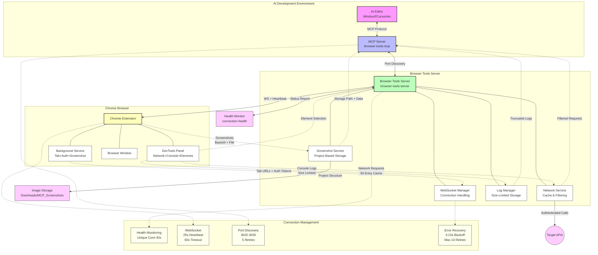

**🚀 Autonomous AI-Powered Frontend Development Platform**

- Contents:
  - Executive Summary
  - System Architecture
  - Server Features
  - Health Monitoring API

## 📋 Executive Summary

This is a comprehensive solution designed for **autonomous AI-powered frontend development workflows**. This system provides AI agents the reliable access to browser state, real-time debugging information, and seamless screenshot capabilities through enhanced WebSocket connections optimized for extended development sessions.

### 🎯 Project Mission

Enable AI development tools to work autonomously for minutes without manual intervention by providing:

- **Stable browser integration** with intelligent connection recovery
- **Real-time context capture** (logs, network requests, screenshots)
- **Organized data storage** for persistent AI workflow continuity
- **Enhanced error handling** for autonomous operation reliability

---

## 🏗️ System Architecture

### Three-Component Architecture



#### 1. **MCP Server** (`browser-tools-mcp/`)

- **Role**: Model Context Protocol implementation
- **Function**: Provides standardized AI tool interface
- **Key Features**: Enhanced server discovery, retry logic, connection health monitoring
- **AI Integration**: Compatible with Windsurf, Cursor, Cline, Zed, Claude Desktop

#### 2. **Browser Tools Server** (`browser-tools-server/`)

- **Role**: Central coordination hub
- **Function**: WebSocket management, data processing, screenshot coordination
- **Key Features**: Enhanced heartbeat system, individual request tracking, auto-port detection
- **Network**: HTTP REST API + WebSocket real-time communication

#### 3. **Chrome Extension** (`chrome-extension/`)

- **Role**: Browser integration layer
- **Function**: Real-time data capture, screenshot execution, DevTools integration
- **Key Features**: Fast reconnection, exponential backoff, streamlined discovery
- **UI**: DevTools panel with connection monitoring and manual controls (embedding management moved to Setup UI)

---

## 🔧 Server Features

- Auto-port detection (starts at 3025, selects 3026–3035 as needed)
- Connection health endpoint at `/connection-health`
- Heartbeat 25s, timeout 60s; fast reconnection (3–15s)
- Identity endpoint at `/.identity`
- Individual request tracking and improved callback cleanup

### 📊 Health Monitoring API

Real-time connection status at `/connection-health`:

```json
{
  "connected": true,
  "healthy": true,
  "connectionId": "conn_1735814017588_abc123",
  "heartbeatTimeout": 60000,
  "heartbeatInterval": 25000,
  "pendingScreenshots": 0,
  "uptime": 3600.45
}
```

---

## ✅ Prerequisites

- Chrome extension installed and DevTools open on the inspected tab
- Browser Tools Server running and discoverable (defaults to port 3025)
- Project configuration in root `projects.json` and env in `.env`

---

## 🧭 Multi‑Project Selection

- Resolution order: request header `X-ACTIVE-PROJECT` → `ACTIVE_PROJECT` env (MCP) → `defaultProject` in root `projects.json`.
- Each project has its own embedding index at `.vectra/<project>` and API doc source.

---

## 🧰 Tools Quick Reference

| Tool                      | What it does                                                                                                                                                      | When to use                                                                                   | Key params                                                                       | Preconditions                                                                                                                       |
| ------------------------- | ----------------------------------------------------------------------------------------------------------------------------------------------------------------- | --------------------------------------------------------------------------------------------- | -------------------------------------------------------------------------------- | ----------------------------------------------------------------------------------------------------------------------------------- |
| `api.searchEndpoints`     | Semantic search over Swagger/OpenAPI. Returns minimal endpoint info (method, path, simple param/request/response hints) and `requiresAuth` from OpenAPI security. | Finding endpoints and basic shapes before coding.                                             | `query?`, `tag?`, `method?`, `limit?`                                            | Embedding index built for the active project; `SWAGGER_URL` configured.                                                             |
| `api.listTags`            | Lists all tags with operation counts.                                                                                                                             | Get a domain overview; seed further API searches.                                             | none                                                                             | `SWAGGER_URL` configured.                                                                                                           |
| `api.request`             | Makes a real HTTP request to `API_BASE_URL`; optionally includes `Authorization: Bearer <token>`. Token source: dynamic via browser storage.                      | Validate exact responses; verify auth/headers; confirm behavior.                              | `endpoint`, `method?`, `requestBody?`, `queryParams?`, `includeAuthToken?`       | `API_BASE_URL` set; if `includeAuthToken: true` then configure `AUTH_STORAGE_TYPE` + `AUTH_TOKEN_KEY` (and optional `AUTH_ORIGIN`). |
| `browser.screenshot`      | Captures current tab, saves to a structured path, and returns the image.                                                                                          | UI analysis, visual verification, before/after loops.                                         | `randomString` (dummy, required by MCP schema)                                   | Extension connected; DevTools open.                                                                                                 |
| `ui.inspectElement`       | Enhanced element context: computed styles, layout relations, issue detection, accessibility hints.                                                                | Rapid UI debugging after selecting an element in DevTools.                                    | none                                                                             | DevTools open and an element selected.                                                                                              |
| `browser.network.inspect` | Recent network requests with filters (URL substring, fields, time window, sort, limit).                                                                           | Debug HTTP failures, payloads, and sequences (DevTools‑like).                                 | `urlFilter`, `details[]`, `timeOffset?`, `orderBy?`, `orderDirection?`, `limit?` | Extension connected; trigger the requests first.                                                                                    |
| `browser.console.read`    | Filtered console messages with stats and formatted output.                                                                                                        | Surface JS errors/warnings/logs quickly.                                                      | `level?`, `limit?`, `timeOffset?`, `search?`                                     | Extension connected; DevTools open.                                                                                                 |
| `browser.navigate`        | Navigates the active tab to a URL.                                                                                                                                | Multi‑step flows; move to pages before taking screenshots or interacting.                     | `url`                                                                            | Extension connected; optional `ROUTES_FILE_PATH` referenced in description.                                                         |
| `ui.interact`             | DOM interactions via semantic selectors (data‑testid, role+name, label, placeholder, name, text, css, xpath) with intelligent waits and CDP fallback.             | Automate clicks/typing/selecting; assert visibility/enabled; optional post‑action screenshot. | `action`, `target`, `scopeTarget?`, `value?`, `options?`                         | Extension connected; DevTools open recommended.                                                                                     |

Notes:

- Prefer `browser.network.inspect` for network errors; console tool does not capture HTTP failures.
- Some MCP clients cache tool descriptions; dynamic updates are not always reflected live.

Planned/disabled:

- The `ui.interact` tool is planned but disabled in the current build. It appears in references for future workflows and may be enabled in a later release.

---

## 🔁 Common Workflows

- API integration

  1. `api.searchEndpoints` → 2) `api.request` → 3) implement/types → 4) iterate.

- UI debugging loop

  1. `browser.screenshot` → 2) select element in DevTools → 3) `ui.inspectElement` → 4) fix → 5) screenshot again.

- Navigation + checks

  1. `browser.navigate` → 2) `browser.screenshot` → 3) `browser.network.inspect`/`browser.console.read`.

- Automated UI interaction
  1. `browser.navigate` → 2) `ui.interact` (perform click/type/etc.) → 3) optional `browser.screenshot` → 4) verify via `browser.network.inspect`.

---

## 🧑‍⚕️ Health & Troubleshooting

- Identity: `GET /.identity` → `{ signature: "mcp-browser-connector-24x7", ... }`
- Connection health: `GET /connection-health` → heartbeat status, uptime, pending screenshots, etc.
- Ports: auto‑select in range 3025–3035 (first free).

---

## ⚠️ Constraints & Tips

- Keep DevTools open on the inspected tab for console, network, selected element, and screenshots.
- Trigger real user actions before inspecting network activity to ensure logs exist.
- When docs lack detailed schemas, pair `api.searchEndpoints` with `api.request` to get exact shapes.
